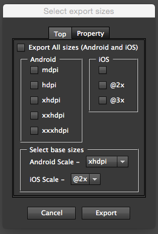

Mobile Export Script for Illustrator
=================================

Script for exporting Illustrator artboards to Android and iOS PNG24 assets in the proper directory structure and scale types.

How To
---
1. Import the script into Illustrator (Instructions for CC listed here)

> To include a script in the Scripts menu (File > Scripts), save the script in the Scripts folder, located in the `/lllustrator CC/Presets` folder in your lllustrator CC installation directory. The script’s filename, minus the file extension, appears in the Scripts menu. Scripts that you add to the Scripts folder while Illustrator is running do not appear in the Scripts menu until the next time you launch Illustrator.

1. Open the Illustrator file that includes the artboards you want to export.
2. Select this script from the Illustrator Scripts menu.
3. A dialog with the supported scale types will open. If any Android types are selected, the proper directory will be created inside `/Android/{SCALE_TYPE}` (e.g. `/Android/drawable-mdpi`, `/Android/drawable-xhdpi`). Any iOS types will be in `/iOS`.

The name of the images will correspond to the name of the artboard. If the artboard is named `app-icon`, and you select all the available options, the script will export the artboard into the following directory structure. The default directory path is same as the Illustrator file of the target. The directory path can be changed in the property-tab.
```
Selected Directory
├───Android
│   ├───drawable-mdpi
│   │   └───app-icon.png
│   ├───drawable-hdpi
│   │   └───app-icon.png
│   ├───drawable-xhdpi
│   │   └───app-icon.png
│   ├───drawable-xxhdpi
│   │   └───app-icon.png
│   ├───drawable-xxxhdpi
│   │   └───app-icon.png
└───iOS
    ├───app-icon.png
    ├───app-icon@2x.png
    └───app-icon@3x.png
```



The default baseline image used for Android is `xhdpi`, for iOS it is `@2x`. The script will scale up and down from these sizes.


License
---
```
Copyright 2014 Austyn Mahoney

Licensed under the Apache License, Version 2.0 (the "License");
you may not use this file except in compliance with the License.
You may obtain a copy of the License at

    http://www.apache.org/licenses/LICENSE-2.0

Unless required by applicable law or agreed to in writing, software
distributed under the License is distributed on an "AS IS" BASIS,
WITHOUT WARRANTIES OR CONDITIONS OF ANY KIND, either express or implied.
See the License for the specific language governing permissions and
limitations under the License.
```
